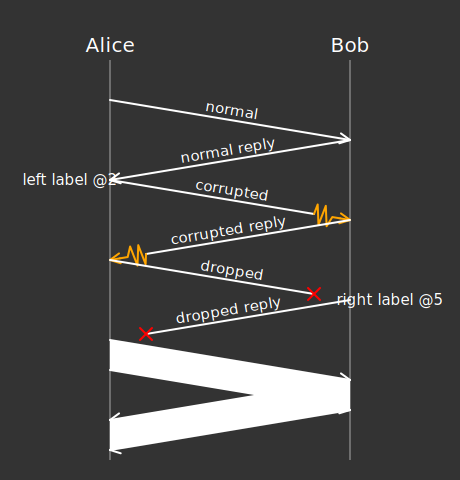

# protocol-ml
Markup language for rendering network protocol diagrams.

## Interactive Demo

Try the live editor: [Demo](https://yeeshin504.github.io/protocol-ml/index.html) (after building with `npm run build:docs`)

### Development

To run the dev server with an example script:

```
npm run dev
```

To run the interactive editor in development mode:

```
npm run dev:docs
```

Currently, the dev server should render this diagram:


